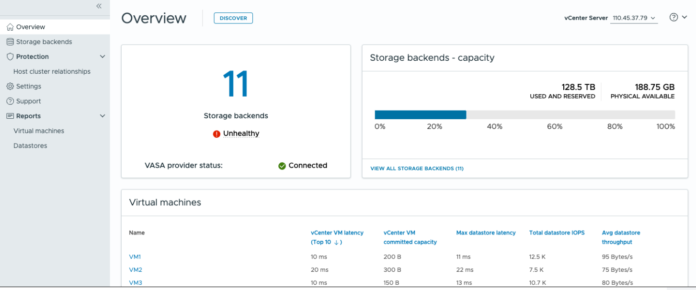

= Scopri la dashboard degli strumenti ONTAP
:allow-uri-read: 
:icons: font
:imagesdir: ../media/

[role="lead"]
Selezionando l'icona del plug-in ONTAP tools for VMware vSphere dalla sezione dei collegamenti nel client vCenter si apre la pagina di panoramica.  Questa dashboard fornisce un riepilogo degli ONTAP tools for VMware vSphere .

In Enhanced Linked Mode (ELM), viene visualizzato il menu a discesa vCenter Server.  Selezionare un vCenter Server per visualizzarne i dati.  Il menu a discesa è disponibile in tutte le viste di elenco del plug-in. Quando si seleziona un vCenter Server in una pagina, questo rimane invariato cambiando scheda nel plug-in.

Dalla pagina di panoramica è possibile eseguire l'azione *Discovery*. L'azione di individuazione rileva i backend di storage, gli host, i datastore e lo stato o le relazioni di protezione aggiunti o aggiornati a livello di vCenter.  Esegui la scoperta su richiesta senza attendere la scoperta pianificata.

NOTE: Il pulsante *Rilevamento* è abilitato solo se si dispone del privilegio necessario per eseguire il rilevamento.

Dopo aver inviato la richiesta di individuazione, è possibile monitorare l'avanzamento dell'azione nel pannello delle attività recenti.

Il cruscotto ha diverse schede che mostrano diversi elementi del sistema. La tabella seguente mostra le diverse schede e ciò che esse rappresentano.

|===

| *Carta* | *Descrizione* 

| Stato | La scheda Stato mostra il numero di backend di archiviazione e lo stato di salute generale dei backend di archiviazione e del VASA Provider. Lo stato dei backend di archiviazione viene visualizzato come *Integro* quando tutti gli stati dei backend di archiviazione sono normali e come *Non integro* se uno qualsiasi dei backend di archiviazione presenta un problema (stato Sconosciuto/Irraggiungibile/Degradato). Seleziona il tool tip per aprire i dettagli sullo stato dei backend di archiviazione. Puoi selezionare qualsiasi backend di archiviazione per maggiori dettagli. Il collegamento *Altri stati del VASA Provider* mostra lo stato corrente del VASA Provider registrato nel vCenter Server. 

| Backend di archiviazione - capacità | Questa scheda mostra la capacità aggregata utilizzata e disponibile di tutti i backend di storage per l'istanza del server vCenter selezionata. Per i sistemi di storage ASA r2, i dati relativi alla capacità non vengono visualizzati perché lo storage è disaggregato. 

| Macchine virtuali | Questa scheda mostra le 10 macchine virtuali principali ordinate in base alla metrica delle prestazioni. È possibile selezionare l'intestazione per ottenere le 10 macchine virtuali principali per la metrica selezionata in ordine crescente o decrescente. Le modifiche di ordinamento e filtraggio apportate alla scheda persistono fino a quando non si modifica o si cancella la cache del browser. 

| Datastore | Questa scheda mostra i 10 principali datastore ordinati in base a una metrica di prestazioni. È possibile selezionare l'intestazione per ottenere i primi 10 datastore per la metrica selezionata ordinati in ordine crescente o decrescente. Le modifiche di ordinamento e filtraggio apportate alla scheda persistono fino a quando non si modifica o si cancella la cache del browser. È disponibile un menu a discesa tipo datastore per selezionare il tipo di datastore: NFS, VMFS o vVol. 

| Scheda di conformità host ESXi | Questa scheda mostra se tutti gli host ESXi (per il vCenter selezionato) seguono le impostazioni host consigliate NetApp per gruppo o categoria. È possibile selezionare il collegamento *Applica impostazioni consigliate* per applicare le impostazioni consigliate. È possibile selezionare lo stato di conformità degli host per visualizzare l'elenco degli host. 
|===