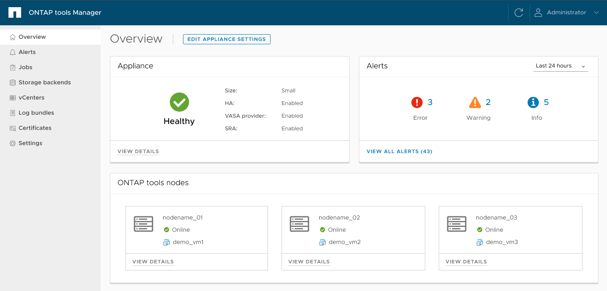

= Scopri l'interfaccia utente di ONTAP tools Manager
:allow-uri-read: 
:icons: font
:imagesdir: ../media/

[role="lead"]
ONTAP tools Manager è una console basata sul web che usi per gestire ONTAP tools for VMware vSphere, incluse le istanze vCenter Server, i backend di storage e la configurazione degli appliance come l'alta disponibilità (HA) e il dimensionamento dei nodi. Supporta il multi-tenancy, quindi puoi gestire più istanze vCenter Server da un'unica interfaccia.

ONTAP Tools Manager è una console basata sul Web per la gestione ONTAP tools for VMware vSphere, istanze di vCenter Server, backend di storage e configurazione di appliance quali High Availability (HA) e ridimensionamento dei nodi.

ONTAP Tools Manager offre le seguenti funzionalità:

* Gestisci avvisi: visualizza e filtra gli avvisi generati dagli ONTAP tools for VMware vSphere.
* Gestisci i backend di archiviazione: aggiungi e gestisci i cluster di archiviazione ONTAP e mappali alle istanze di vCenter Server a livello globale.
* Gestisci istanze di vCenter Server: aggiungi e gestisci istanze di vCenter Server all'interno degli strumenti ONTAP .
* Monitora i job: monitora ed esegui il debug dei job asincroni avviati sia dall'interfaccia del plug-in ONTAP tools che dall'interfaccia di ONTAP tools Manager. Puoi filtrare i job per periodo di tempo, regolare la dimensione della pagina e visualizzare i dettagli del job, inclusi errori e sotto-attività. Seleziona lo stato di errore per visualizzare i dettagli dell'errore. Per i job con sotto-attività, espandi la riga per visualizzare descrizioni e stati. Per i sotto-job, usa il drilldown del job per visualizzarne i dettagli.
* Scarica i bundle di log: raccogli i file di log per risolvere i problemi ONTAP tools for VMware vSphere.
* Gestisci certificati: sostituisci il certificato autofirmato con un certificato CA personalizzato e rinnova o aggiorna i certificati per gli strumenti VASA Provider e ONTAP .
* Reimposta password: modifica la password per il provider VASA e SRA.
* Gestisci le impostazioni dell'appliance: configura l'appliance degli strumenti ONTAP , inclusa l'abilitazione dell'HA e l'aumento delle dimensioni dei nodi.

Per accedere a ONTAP tools Manager, avvia  `\https://<ONTAPtoolsIP>:8443/virtualization/ui/` dal browser ed effettua l'accesso con le credenziali di amministratore di ONTAP tools for VMware vSphere che hai fornito durante la distribuzione.

|===
| *Carta* | *Descrizione* 

| Scheda dell'appliance | La scheda Appliance mostra lo stato generale dell'appliance degli strumenti ONTAP , i dettagli di configurazione e lo stato dei servizi abilitati.  Per visualizzare maggiori informazioni, seleziona il link *Visualizza dettagli*.  Se si modifica un'impostazione dell'apparecchio, la scheda mostra lo stato del lavoro e i dettagli fino al completamento della modifica. 

| Scheda avvisi | La scheda Avvisi mostra gli avvisi degli strumenti ONTAP classificati per tipo, inclusi gli avvisi a livello di nodo HA.  È possibile visualizzare avvisi dettagliati facendo clic sul collegamento ipertestuale del conteggio, che conduce alla pagina degli avvisi filtrati in base al tipo di avviso selezionato. 

| Scheda vCenters | La scheda vCenter mostra lo stato di integrità di tutte le istanze di vCenter Server gestite dagli strumenti ONTAP .  È possibile visualizzare i dettagli di ciascun vCenter selezionando il collegamento corrispondente, che conduce a una pagina con maggiori informazioni sull'istanza selezionata. 

| Scheda backend di archiviazione | La scheda Backend di archiviazione mostra lo stato di integrità e connettività di tutti i cluster di archiviazione ONTAP configurati negli strumenti ONTAP .  È possibile visualizzare i dettagli per ciascun backend di archiviazione selezionando il collegamento corrispondente, che conduce a una pagina con maggiori informazioni sul cluster selezionato. 

| Scheda nodi strumenti ONTAP | La scheda dei nodi di ONTAP tools mostra tutti i nodi dell'appliance, inclusi nome del nodo, nome della VM, stato e informazioni di rete. Seleziona *Visualizza dettagli* per vedere più dettagli su un nodo specifico. [NOTA] In una configurazione non HA, appare solo un nodo. In una configurazione HA, appaiono tre nodi. 
|===