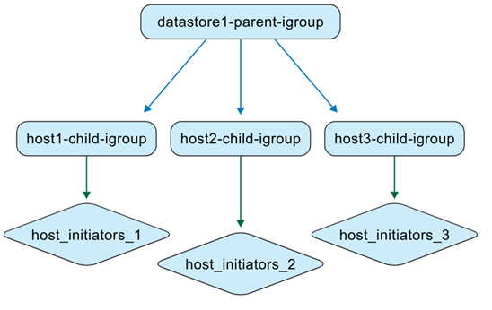

= Come ONTAP tools gestisce gli igroup
:allow-uri-read: 
:icons: font
:imagesdir: ../media/

[role="lead"]
Se gestisci sia le macchine virtuali ONTAP tools che i sistemi di storage ONTAP, è importante comprendere il comportamento degli igroup, soprattutto quando si spostano datastore da ambienti non gestiti da ONTAP tools a quelli che lo sono. Questa pagina spiega come ONTAP tools per VMware vSphere rappresenta e gestisce gli igroup. Si tratta di informazioni concettuali utili per comprendere le differenze di comportamento tra le versioni precedenti e l'attuale modello di igroup annidato.

A partire da ONTAP tools for VMware vSphere 10.4, ONTAP tools for VMware crea e gestisce automaticamente oggetti ONTAP e vCenter, semplificando la gestione dei datastore negli ambienti datacenter VMware. A partire da ONTAP tools for VMware vSphere 10.5 P2, anche gli igroup migrati vengono eliminati automaticamente quando non sono più in uso.

== Riepilogo rapido del comportamento

* I datastore VMFS gestiti dagli strumenti ONTAP utilizzano igroup nidificati: un igroup padre per ogni contesto di datastore e igroup figli per ogni host.
* Le mappature LUN vengono applicate agli igroup figli.
* Gli igroup padre personalizzati possono essere riutilizzati in diversi datastore.
* Gli igroup migrati da ONTAP tools 9.x non possono essere riutilizzati.

== Contesti di gruppo

ONTAP tools for VMware vSphere gestisce gli igroup in due contesti.

.Strumenti non ONTAP gestiti da igroup
In qualità di amministratore dello storage, puoi creare igroup sul sistema ONTAP come strutture piatte o nidificate. L'illustrazione seguente mostra un igroup piatto creato direttamente in ONTAP.

image:../media/non-otv-managed.png["Strumenti non ONTAP gestiti igroup"]

.Strumenti ONTAP gestiti igroup
Quando si creano datastore, ONTAP tools for VMware vSphere crea igroups in una struttura annidata.

Ad esempio, quando datastore1 viene creato e montato sugli host 1, 2 e 3 e un nuovo datastore (datastore2) viene creato e montato sugli host 3, 4 e 5, gli strumenti ONTAP riutilizzano l'igroup a livello di host per una gestione efficiente.

image:../media/otv-managed2.png["Strumenti ONTAP gestiti igroup con igroup figlio riutilizzati"]

== Comportamento di denominazione

Quando si crea un datastore e si lascia vuoto il campo igroup, ONTAP tools crea una struttura igroup nidificata predefinita.

* Schema di denominazione dell'igroup padre: `otv_<vcguid>_<host_parent_datacenterMoref>_<datastore_name>`
* Schema di denominazione degli igroup figlio: `otv_<hostMoref>_<vcguid>`

L'interfaccia di sistema ONTAP mostra la relazione tra igroup padre e figlio nel campo *Gruppo iniziatore padre*.

== Comportamento in base allo scenario

[cols="25,25,25,25"]
|===
| Scenario | Comportamento del gruppo igroup genitore | Comportamento del gruppo figlio | Mappatura e visibilità delle LUN 

| Datastore creato con l'impostazione predefinita dell'igroup | Viene creato un igroup padre predefinito gestito dagli ONTAP tools. | Gli igroup figlio a livello host vengono creati secondo necessità. | Le LUN vengono mappate agli igroup figlio. Il datastore viene visualizzato nell'inventario del server vCenter. 

| Datastore creato con nome igroup personalizzato | Viene creato un igroup padre personalizzato con il nome specificato. | Gli igroup figlio a livello host esistenti vengono riutilizzati quando gli host si sovrappongono. | Il nuovo LUN del datastore viene mappato all'igroup figlio riutilizzato o appena creato. Il datastore appare in vCenter Server. 

| Gruppo igroup personalizzato esistente riutilizzato durante la creazione del datastore | Viene selezionato e riutilizzato un igroup padre personalizzato esistente. | Gli igroup figlio vengono riutilizzati o estesi in base all'appartenenza all'host. | Il nuovo LUN del datastore viene mappato tramite l'igroup figlio associato. Il datastore appare in vCenter Server. 

| Datastore e igroup creati nativamente in ONTAP e vCenter, quindi rilevati dagli ONTAP tools | ONTAP tools crea un igroup padre nel proprio contesto di gestione e mantiene il nome originale dell'igroup. | ONTAP tools rinomina l'igroup originale con il  `otv_` prefix e lo rappresenta come igroup figlio nella gerarchia. | Le mappature degli initiator rimangono invariate. Solo gli igroups mappati ai datastores vengono convertiti durante il rilevamento. 
|===

== Riutilizzo personalizzato degli igroup e comportamento delle API

Nell'interfaccia utente degli strumenti ONTAP, è possibile riutilizzare un igroup padre personalizzato esistente dall'elenco a discesa durante la creazione di un datastore.

Lo stesso comportamento è supportato tramite API. Per riutilizzare un igroup esistente durante la creazione del datastore, fornire l'UUID dell'igroup nella richiesta payload dell'API.

NOTE: È possibile riutilizzare solo gli igroup personalizzati. Gli igroup migrati da ONTAP tools 9.x non possono essere riutilizzati e, a partire da ONTAP tools 10.5 P2, vengono eliminati automaticamente quando non sono più in uso.

== Vista di conversione da nativo a gestito

Se si creano igroup e datastore direttamente nei sistemi ONTAP e negli ambienti VMware, ONTAP tools inizialmente non gestisce questi oggetti. Ciò si traduce in una struttura igroup piatta.

image:../media/vmfsds-native.png["Datastore e igroup creati in modo nativo"]

Dopo il rilevamento del datastore, ONTAP tools identifica e registra gli igroup mappati al datastore, quindi li rappresenta in un modello annidato. L'igroup padre è rappresentato a livello di datastore, l'igroup esistente viene rinominato con il  `otv_` prefisso come igroup figlio e le mappature dell'initiator rimangono invariate.

image:../media/otv-ds.png["Datastore e igroup gestiti dagli strumenti ONTAP"]

ONTAP tools for VMware vSphere non rileva né gestisce gli igroup creati nei sistemi ONTAP ma non mappati a un datastore o collegati a ONTAP tools. Durante la fase di rilevamento, ONTAP tools converte solo gli igroup mappati ai datastore rilevati; gli altri igroup rimangono non gestiti.

== Riutilizzo degli igroup nativi scoperti

Dopo che ONTAP tools gestisce un igroup nativo rilevato, tale igroup è disponibile nell'elenco a discesa del nome del gruppo initiator personalizzato per la creazione del datastore.

Il nuovo LUN del datastore viene mappato all'igroup figlio normalizzato, ad esempio, `otv_NativeIgroup1`.

ONTAP tools for VMware vSphere non rileva né utilizza gli igroups creati nei sistemi ONTAP che non sono gestiti da ONTAP tools o non sono collegati a un datastore.
