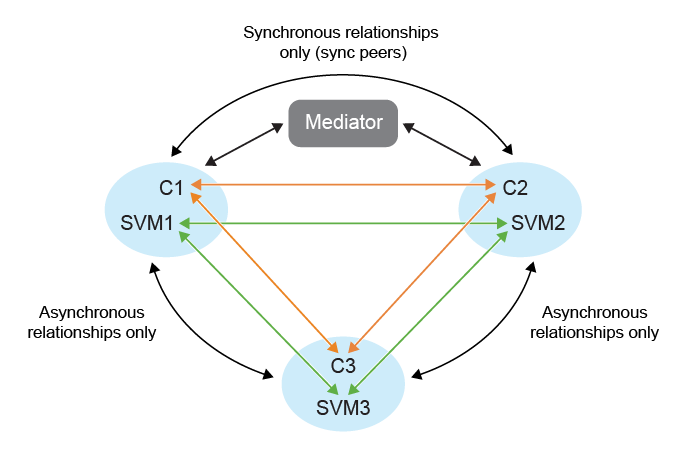

= Protezione fan-out
:allow-uri-read: 
:icons: font
:imagesdir: ../media/

[role="lead"]
In uno scenario di protezione fan-out, il gruppo di coerenza è doppiamente protetto con relazione sincrona sul primo cluster ONTAP di destinazione e con relazione asincrona sul secondo cluster ONTAP di destinazione.  I flussi di lavoro di creazione, modifica ed eliminazione della protezione ActiveSync SnapMirror mantengono la protezione sincrona.  I flussi di lavoro di failover e riprotezione dell'appliance VMware Live Site Recovery mantengono la protezione asincrona.

NOTE: Il fan-out non è supportato per l'utente SVM.

Per impostare la protezione fan-out, collegare in peering i tre cluster di siti e le SVM.

Esempio:

|===

| Se | quindi 

 a| 
* Il gruppo di coerenza di origine è nel cluster C1 e SVM svm1
* Il primo gruppo di coerenza di destinazione è sul cluster C2 e SVM svm2 e.
* Il secondo gruppo di coerenza di destinazione è sul cluster C3 e SVM svm3

 a| 
* Il peering dei cluster sul cluster ONTAP di origine sarà (C1, C2) e (C1, C3).
* Il peering del cluster sul primo cluster ONTAP di destinazione sarà (C2, C1), (C2, C3) e.
* Il peering del cluster sul secondo cluster ONTAP di destinazione sarà (C3, C1) e (C3, C2).
* Il peering delle SVM sull'origine SVM sarà (svm1, svm2) e (svm1, svm3).
* Il peering delle SVM sulla prima SVM di destinazione sarà (svm2, svm1) e (svm2, svm3) e.
* Il peering delle SVM sulla seconda destinazione SVM sarà (svm3, svm1) e (svm3, svm2).

|===
Il diagramma seguente mostra la configurazione della protezione fan-out:image:../media/fan-out-protection.png["Configurazione della protezione fan-out"] 

.Fasi
. Selezionare un nuovo datastore segnaposto.  I criteri di selezione del datastore segnaposto per la protezione graduale sono:
+
** Non posizionare il datastore segnaposto nel cluster host che stai proteggendo.
** Se è necessario includere il datastore segnaposto nel cluster host, aggiungerlo all'appliance VMware Live Site Recovery prima di configurare la protezione ActiveSync SnapMirror .  Con questa configurazione, è possibile lasciare il datastore segnaposto fuori dalla protezione.
+
Per maggiori informazioni, fare riferimento a https://techdocs.broadcom.com/us/en/vmware-cis/live-recovery/site-recovery-manager/8-8/site-recovery-manager-administration-8-8/about-placeholder-virtual-machines/configure-a-placeholder-datastore.html["Selezionare un datastore segnaposto"]

. Aggiungere il datastore alla protezione del cluster host seguendo quanto seguelink:../manage/edit-hostcluster-protection.html["Modificare il cluster host protetto"] .  Aggiungere tipi di policy sia asincroni che sincroni.

