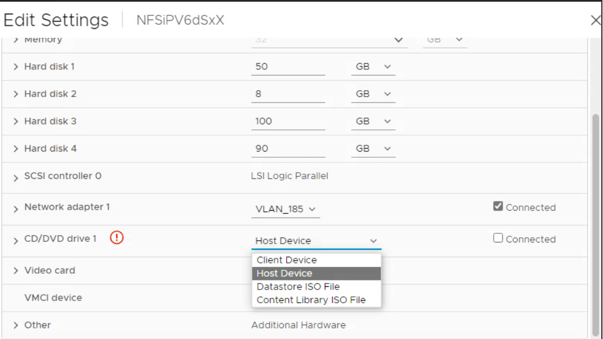

= Aggiornamento dai tool ONTAP per VMware vSphere 10.x alla 10,3
:allow-uri-read: 
:icons: font
:imagesdir: ../media/

[role="lead"]
L'aggiornamento è supportato per le implementazioni ha e non ha. I percorsi di aggiornamento supportati sono:

|===

| Dai tool ONTAP per la configurazione di VMware vSphere 10,1 e 10,2 | Ai tool ONTAP per la configurazione di VMware vSphere 10,3 

| Non ha piccolo | Non ha e avanzato piccolo 

| Terreno non ha | Non ha e terreno avanzato 

| Avanzato piccolo | Non ha e avanzato piccolo 

| Supporto avanzato | Non ha e terreno avanzato 

| HA piccolo | HA piccolo 

| HA medio | HA medio 

| HA grande | HA grande 
|===

NOTE: L'aggiornamento è supportato dai tool ONTAP per VM ware vSphere 10,1 e 10,2 a 10,3. L'aggiornamento diretto dagli strumenti ONTAP da 10,0 a 10,3 non è supportato.

*Prima di iniziare*

Per l'aggiornamento non ha, spegnere la VM degli strumenti ONTAP e per l'aggiornamento ha, spegnere il primo nodo prima di apportare le seguenti modifiche alle impostazioni della macchina virtuale (VM).

* Aggiungere un disco rigido aggiuntivo di 100 GB su ciascun nodo quando i dati dei servizi vengono memorizzati localmente sulla VM.
* Modificare la CPU e la memoria per le macchine virtuali spente in base alle caratteristiche dell'implementazione. Abilita hot plug-in per CPU e RAM.
+
|===
| 10,3 tipo di implementazione | CPU (core) per nodo | Memoria (GB) per nodo | Spazio su disco (GB) per nodo | CPU totale (core) | Memoria (GB) | Spazio su disco totale (GB) 

| Non ha Small | 9 | 18 | 350 | 9 | 18 | 350 

| Terreno non ha | 13 | 26 | 350 | 13 | 26 | 350 

| HA piccolo | 9 | 18 | 350 | 27 | 54 | 1050 

| HA Media | 13 | 26 | 350 | 39 | 78 | 1050 

| HA grande | 17 | 34 | 350 | 51 | 102 | 1050 
|===
* Accendere la macchina virtuale, dopo aver apportato le modifiche e attendere che i servizi diventino operativi.
* In caso di implementazione ha, apportare le modifiche alle risorse, abilitare il plug-in hot per CPU e RAM e aggiungere un disco rigido da 100 GB anche per il secondo e il terzo nodo. Non è necessario riavviare questi nodi.
* Se l'appliance è stata implementata come percorso locale (facile implementazione) con gli strumenti ONTAP versione 10,1 o 10,2, è necessario acquisire snapshot quiesce prima dell'aggiornamento.

Se si esegue l'aggiornamento dagli strumenti ONTAP per VMware vSphere 10,0 a 10,1, è necessario completare i seguenti passaggi prima di procedere con l'attività di aggiornamento:

*Attiva diagnostica*

. Da vCenter Server, aprite una console agli strumenti ONTAP.
. Accedere come utente di manutenzione.
. Immettere *4* per selezionare *supporto e diagnostica*.
. Immettere *2* per selezionare *attiva accesso diagnostico remoto*.
. Immettere *y* per impostare la password desiderata.
. Accedere all'indirizzo IP della macchina virtuale dal terminale/putty con l'utente come 'diag' e la password impostata nel passaggio precedente.

*Esegui il backup di MongoDB*

Esegui i seguenti comandi per eseguire un backup di MongoDB:

* kn exec -it ntv-mongodb-0 sh - kn è un alias di kubectl -n ntv-system.
* Env | grep MONGODB_ROOT_PASSWORD - esegui questo comando all'interno del pod.
* 'esci' - eseguire questa operazione per uscire dal pod.
* KN exec ntv-mongodb-0 --mongodump -u root -p MONGODB_ROOT_PASSWORD --archive=/tmp/mongodb-backup.gz --gzip - esegui questo comando per sostituire MONGO_ROOT_PASSWORD set dal comando precedente.
* kn cp ntv-mongodb-0:/tmp/mongodb-backup.gz ./mongodb-backup.gz - eseguire questo comando per copiare il backup mongodb creato utilizzando il comando sopra riportato da pod all'host.

*Prendere l'istantanea quaise di tutti i volumi*

* Eseguire il comando 'kN get pvc' e salvare l'output del comando.
* Acquisire snapshot di tutti i volumi uno alla volta utilizzando uno dei seguenti metodi:
+
** Dalla CLI, eseguire il comando _volume snapshot create -vserver <vserver_name> -volume <volume_name> -snapshot <snapshot_name>_
** Dall'interfaccia utente di ONTAP System Manager, cercare il volume in base al nome nella barra di ricerca, quindi aprire il volume facendo clic sul nome. Andare allo snapshot e aggiungere lo snapshot di quel volume.

*Istantanea degli strumenti ONTAP per le VM VMware vSphere in vCenter (3VMs in caso di implementazione ha, 1 VM in caso di distribuzione non ha)*

* Nell'interfaccia utente del client vSphere, selezionare la VM.
* Andare alla scheda istantanee e fare clic sul pulsante *scatta istantanea*. Creare un'istantanea inattiva della VM. Per ulteriori dettagli, fare riferimento https://docs.vmware.com/en/VMware-vSphere/7.0/com.vmware.vsphere.vm_admin.doc/GUID-9720B104-9875-4C2C-A878-F1C351A4F3D8.html["Scattare una fotografia istantanea di una macchina virtuale"^] a.

Prima di eseguire l'aggiornamento, eliminare i pod completati con il prefisso "generate-support-bundle-job".
Se è in corso la generazione del bundle di supporto, attendere che venga completato, quindi eliminare il pod.

È necessario aggiungere un'unità disco rigido (HDD) aggiuntiva di dimensioni 100GB per qualsiasi tipo di aggiornamento. Per aggiungere un disco rigido, eseguire la seguente operazione.

. Seleziona la macchina virtuale in configurazione a nodo singolo o tutte le tre macchine virtuali nella configurazione ha.
. Fare clic con il pulsante destro del mouse sulla macchina virtuale e selezionare *Aggiungi nuovo dispositivo* > *disco rigido*
. Nel campo *nuovo disco fisso*, aggiungere un disco fisso di 100 GB.
. Fare clic su *Applica*

Dopo aver aggiunto il disco rigido, aggiornare le risorse della macchina virtuale per le rispettive configurazioni e riavviare la macchina virtuale primaria.

Verrà creato un nuovo disco rigido. Il provisioner dinamico dello storage utilizza questo HDD per creare o replicare i volumi.

*Fasi*

. Carica gli strumenti ONTAP per l'aggiornamento ISO di VMware vSphere nella libreria di contenuti.
. Nella pagina principale della macchina virtuale, selezionare *azioni* > *Modifica impostazioni*
. Nella finestra di modifica delle impostazioni sotto il campo *unità CD/DVD*, selezionare file ISO della libreria di contenuti.
. Selezionare il file ISO e fare clic su *OK*. Selezionare la casella di controllo connesso nel campo *unità CD/DVD*.

. Da vCenter Server, aprite una console agli strumenti ONTAP.
. Accedere come utente di manutenzione.
. Immettere *3* per selezionare il menu Configurazione di sistema.
. Immettere *7* per selezionare l'opzione di aggiornamento.
. Quando si esegue l'aggiornamento, le seguenti azioni vengono eseguite automaticamente:
+
.. Aggiornamento del certificato
.. Aggiornamento del plug-in remoto

Dopo l'aggiornamento ai tool ONTAP per VMware vSphere 10,3, puoi:

* Disattivare i servizi dall'interfaccia utente di Manager
* Passaggio da una configurazione non ha a una configurazione ha
* Scala in verticale una configurazione piccola non ha a un supporto non ha o a una configurazione ha media o grande.
* In caso di aggiornamento non ha, riavviare la VM degli strumenti ONTAP per riflettere le modifiche. In caso di upgrade ha, riavviare il primo nodo per riflettere le modifiche sul nodo.

*Al termine*

Dopo aver eseguito l'aggiornamento dalle versioni precedenti degli strumenti ONTAP per VMware vSphere alla versione 10,3, eseguire nuovamente la scansione degli adattatori SRA per verificare che i dettagli siano aggiornati nella pagina adattatori di replica dello storage per VMware Live Site Recovery.

Una volta completato l'aggiornamento, eliminare manualmente i Trident Volumes da ONTAP seguendo la procedura indicata di seguito:

NOTE: Questi passaggi non sono necessari se i tool ONTAP per VMware vSphere 10,1 o 10,2 si trovavano in configurazioni non ha di piccole dimensioni o non ha di medie dimensioni (percorso locale).

. Da vCenter Server, aprite una console agli strumenti ONTAP.
. Accedere come utente di manutenzione.
. Immettere *4* per selezionare il menu *supporto e diagnostica*.
. Immettere *1* per selezionare l'opzione *Access Diagnostics shell* (accesso alla shell di diagnostica).
. Eseguire il seguente comando
+
[listing]
----
sudo python3 /home/maint/scripts/ontap_cleanup.py
----
. Immettere il nome utente e la password di ONTAP

Questo consente di eliminare tutti i volumi Trident presenti in ONTAP utilizzati nei tool ONTAP per VMware vSphere 10,1/10,2.
